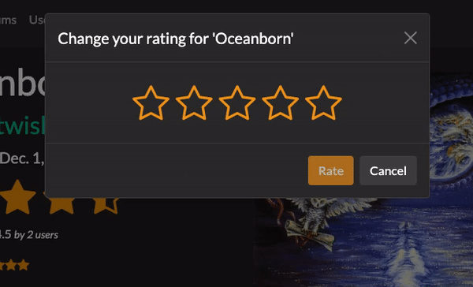
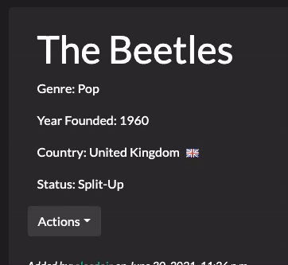

# The Music Database
### Created with Django  
 

## Home page will show recent additions to the database, and the newest album releases  
  

 

## Users can submit bands and albums to the database  
  

 

## Rate albums out of 5  
  

 

## Edit bands with an intuitive JavaScript tool
  

 

## Other Features
* Styled with Bootstrap
* Responsive for mobile/desktop viewing
* Login and Registration
    * Passwords salted and hashed
    * Form validation
